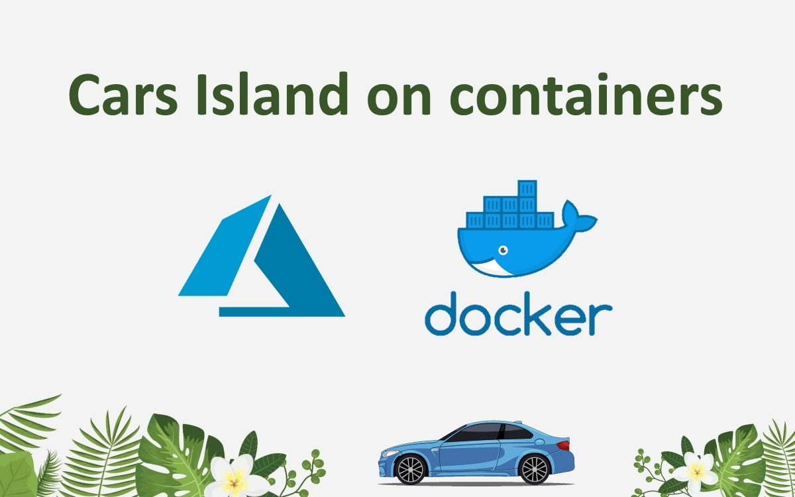

# Cars Island microservices
 
 *This repository contains sample microservices solution build with ASP .NET Core and Azure cloud services*



Cars Island is a fake car rental company which used service oriented architecture to implement the system for managing car renting.

## Below main chapters are covered (will be extended in the future):

#### [1. Asynchronous Messaging with Azure Service Bus](#asynchronous-messaging-with-azure-service-bus)


# Asynchronous Messaging with Azure Service Bus

## Solution architecture

To demonstrate how to use Azure Service Bus to provide asynchronous communication between microservices I decided to start the development of a sample solution called Cars Island. Source code is available on [my GitHub.](https://github.com/Daniel-Krzyczkowski/MicrosoftAzure/tree/master/asp-net-core-microservices-with-azure-and-docker). This project is based on the [eShop on containers solution](https://github.com/dotnet-architecture/eShopOnContainers) which I found a bit heavy so that is why I decided to create my solution. In the Cars Island solution there are four microservices:

<p align="center">

</p>

In this section, we are going to talk about communication between *Catalog* microservice and *Reservation* microservice. Just to remind - we would like to use Azure Service Bus to inform other services that specific events happened. In this case, we will talk about changing the price per day for renting the car. Once the price per day is changed in the *Catalog* microservice, we would like to inform *Reservation* microservice about it.


## Car price per day changed integration event

When talking about communication between microservices we are talking about integration events in this case. We do not want to tightly couple microservices, that is why we will use the Azure Service Bus and [Publish/Subscribe](https://docs.microsoft.com/en-us/azure/architecture/patterns/publisher-subscriber) pattern to provide asynchronous communication. In the *Catalog* microservice, there is a class called *CarPricePerDayChangedIntegrationEvent*:

```csharp
    public class CarPricePerDayChangedIntegrationEvent : IntegrationEvent
    {
        public Guid CarId { get; private set; }

        public decimal NewPricePerDay { get; private set; }

        public decimal OldPricePerDay { get; private set; }

        public CarPricePerDayChangedIntegrationEvent(Guid carId, decimal newPricePerDay, decimal oldPricePerDay)
        {
            CarId = carId;
            NewPricePerDay = newPricePerDay;
            OldPricePerDay = oldPricePerDay;
        }
    }
```

As we can see there is information about the old price per day for renting the car and new price per day. There is also a car ID to identify the car for which the price was updated. In the base, an abstract class called *IntegrationEvent* two properties should always bee included in the event information so the ID and creation date:


```csharp
    public abstract class IntegrationEvent
    {
        [JsonConstructor]
        public IntegrationEvent()
        {
            Id = Guid.NewGuid();
            CreationDate = DateTime.UtcNow;
        }

        [JsonProperty]
        public Guid Id { get; private set; }

        [JsonProperty]
        public DateTime CreationDate { get; private set; }
    }
```

Of course there can be many different events but to make it simple we are going to talk about price change event.

## Car price per day changed integration event handler

 For each event we need of course event handler. For the *CarPricePerDayChangedIntegrationEvent* we need *CarPricePerDayChangedIntegrationEventHandler* which is located in the *Reservation* microservice:

```csharp
    public class CarPricePerDayChangedIntegrationEventHandler : IIntegrationEventHandler<CarPricePerDayChangedIntegrationEvent>
    {
        private readonly ILogger<CarPricePerDayChangedIntegrationEventHandler> _logger;
        private readonly IReservationRepository _reservationRepository;

        public CarPricePerDayChangedIntegrationEventHandler(ILogger<CarPricePerDayChangedIntegrationEventHandler> logger,
                                                            IReservationRepository reservationRepository)
        {
            _logger = logger ?? throw new ArgumentNullException(nameof(logger));
            _reservationRepository = reservationRepository ?? throw new ArgumentNullException(nameof(reservationRepository));
        }

        public async Task HandleAsync(CarPricePerDayChangedIntegrationEvent @event)
        {
            _logger.LogInformation("Handling integration event: {IntegrationEventId} - ({@IntegrationEvent})", @event.Id, @event);

            var userIds = _reservationRepository.GetUsers();

            foreach (var id in userIds)
            {
                var customerReservation = await _reservationRepository.GetReservationAsync(id);

                await UpdatePriceInCustomerReservation(@event.CarId, @event.NewPricePerDay, @event.OldPricePerDay, customerReservation);
            }
        }

        private async Task UpdatePriceInCustomerReservation(Guid carId, decimal newPrice,
                                                            decimal oldPrice, CustomerReservation reservation)
        {
            if (carId == reservation.Car.Id)
            {
                _logger.LogInformation($"{nameof(CarPricePerDayChangedIntegrationEventHandler)} - Updating car price in reservation for the customer: {reservation.CustomerId}", reservation.CustomerId);

                if (reservation.Car.PricePerDay == oldPrice)
                {
                    reservation.Car.PricePerDay = newPrice;
                }
                await _reservationRepository.UpdateReservationAsync(reservation);
            }
        }
    }
```

As we can see in the source code above, we are able to handle the event related to chaning the price per day. We can access repository with reservations, find all reservations where this specific car was reserved (with the specific ID) and we can update this price.


## Event bus implementation

In the project called *CarsIsland.EventBus* we can find all the source code that is shared among microservices in the solution to provide asynchronous communication with Azure Service Bus. Let's start with subscriptions. In our solution, there can be many events sent. There will be an event emitted when the car price per day changed, when the customer completed the payment or when the customer canceled the reservation. Now some of the microservices can be interested in receiving such events so they can react and update the data related to their domain. In our case, if there is a chance in the *Catalog* microservice related to car price per day, *Reservation* microservice should be notified to update this price on the reservation.

### Subscription manager

As mentioned above we would like to make sure that each microservice will receive only these events to which it subscribed. All others should be ignored. To make it possible we need a subscription manager. This class will be responsible for managing events subscriptions and providing specific handlers so these events can be handled by specific microservice. Let's look at the *IEventBusSubscriptionsManager* interface:

```csharp
    public interface IEventBusSubscriptionsManager
    {
        bool IsEmpty { get; }

        event EventHandler<string> OnEventRemoved;

        void AddSubscription<T, TH>()
           where T : IntegrationEvent
           where TH : IIntegrationEventHandler<T>;

        void RemoveSubscription<T, TH>()
           where TH : IIntegrationEventHandler<T>
           where T : IntegrationEvent;

        bool HasSubscriptionsForEvent<T>() where T : IntegrationEvent;

        bool HasSubscriptionsForEvent(string eventName);

        Type GetEventTypeByName(string eventName);

        void Clear();

        IEnumerable<SubscriptionInfo> GetHandlersForEvent<T>() where T : IntegrationEvent;

        IEnumerable<SubscriptionInfo> GetHandlersForEvent(string eventName);

        string GetEventKey<T>();
    }
```

As we can see there are operations like adding subscription, removing it or verifying whether subscription for specific event exists. The implementation of this interface is available in the *InMemoryEventBusSubscriptionsManager* class in the same project.


### Azure Service Bus Event Bus

Once we have subscription manager we have to also connect to the Azure Service Bus to be able to publish events and receive them asynchronously. To do it we have to implement class called *AzureServiceBusEventBus* where we use [Azure Service Bus SDK](https://www.nuget.org/packages/Microsoft.Azure.ServiceBus/):

```csharp
    public class AzureServiceBusEventBus : IEventBus
    {
        private readonly SubscriptionClient _subscriptionClient;
        private readonly IEventBusSubscriptionsManager _subscriptionManager;
        private readonly IServiceBusConnectionManagementService _serviceBusConnectionManagementService;
        private readonly IServiceProvider _serviceProvider;
        private readonly ILogger<AzureServiceBusEventBus> _logger;

        public AzureServiceBusEventBus(IServiceBusConnectionManagementService serviceBusConnectionManagementService,
                        IEventBusSubscriptionsManager subscriptionManager,
                        IServiceProvider serviceProvider,
                        ILogger<AzureServiceBusEventBus> logger,
                        string subscriptionClientName)
        {
            _serviceBusConnectionManagementService = serviceBusConnectionManagementService;
            _subscriptionManager = subscriptionManager;
            _subscriptionClient = _subscriptionClient = new SubscriptionClient(_serviceBusConnectionManagementService.ServiceBusConnectionStringBuilder,
                subscriptionClientName);
            _serviceProvider = serviceProvider;
            _logger = logger;
        }

        public async Task SetupAsync()
        {
            try
            {
                await RemoveDefaultRuleAsync();
                RegisterSubscriptionClientMessageHandler();
            }

            catch (MessagingEntityNotFoundException)
            {
                _logger.LogWarning("The messaging entity '{DefaultRuleName}' Could not be found.", RuleDescription.DefaultRuleName);
            }
        }

        public async Task PublishAsync(IntegrationEvent @event)
        {
            var eventName = @event.GetType().Name;
            var jsonMessage = JsonConvert.SerializeObject(@event);
            var body = Encoding.UTF8.GetBytes(jsonMessage);

            var message = new Message
            {
                MessageId = Guid.NewGuid().ToString(),
                Body = body,
                Label = eventName,
            };

            var topicClient = _serviceBusConnectionManagementService.CreateTopicClient();
            await topicClient.SendAsync(message);
        }

        public async Task SubscribeAsync<T, TH>()
            where T : IntegrationEvent
            where TH : IIntegrationEventHandler<T>
        {
            var eventName = typeof(T).Name;

            var containsKey = _subscriptionManager.HasSubscriptionsForEvent<T>();
            if (!containsKey)
            {
                try
                {
                    await _subscriptionClient.AddRuleAsync(new RuleDescription
                    {
                        Filter = new CorrelationFilter { Label = eventName },
                        Name = eventName
                    });
                }
                catch (ServiceBusException)
                {
                    _logger.LogWarning("The messaging entity '{eventName}' already exists.", eventName);
                }
            }

            _logger.LogInformation("Subscribing to event '{EventName}' with '{EventHandler}'", eventName, typeof(TH).Name);
            _subscriptionManager.AddSubscription<T, TH>();
        }

        public async Task UnsubscribeAsync<T, TH>()
            where T : IntegrationEvent
            where TH : IIntegrationEventHandler<T>
        {
            var eventName = typeof(T).Name;

            try
            {
                await _subscriptionClient.RemoveRuleAsync(eventName);
            }
            catch (MessagingEntityNotFoundException)
            {
                _logger.LogWarning("The messaging entity '{eventName}' Could not be found.", eventName);
            }

            _logger.LogInformation("Unsubscribing from event '{EventName}'", eventName);
            _subscriptionManager.RemoveSubscription<T, TH>();
        }

        private void RegisterSubscriptionClientMessageHandler()
        {
            _subscriptionClient.RegisterMessageHandler(
                async (message, token) =>
                {
                    var eventName = message.Label;
                    var messageData = Encoding.UTF8.GetString(message.Body);

                    if (await ProcessEvent(eventName, messageData))
                    {
                        await _subscriptionClient.CompleteAsync(message.SystemProperties.LockToken);
                    }
                },
                new MessageHandlerOptions(ExceptionReceivedHandler) { MaxConcurrentCalls = 10, AutoComplete = false });
        }

        private Task ExceptionReceivedHandler(ExceptionReceivedEventArgs exceptionReceivedEventArgs)
        {
            var ex = exceptionReceivedEventArgs.Exception;
            var context = exceptionReceivedEventArgs.ExceptionReceivedContext;

            _logger.LogError(ex, "ERROR handling message: '{ExceptionMessage}' - Context: '{ExceptionContext}'", ex.Message, context);

            return Task.CompletedTask;
        }

        private async Task<bool> ProcessEvent(string eventName, string message)
        {
            var processed = false;
            if (_subscriptionManager.HasSubscriptionsForEvent(eventName))
            {
                var subscriptions = _subscriptionManager.GetHandlersForEvent(eventName);
                foreach (var subscription in subscriptions)
                {
                    var handler = _serviceProvider.GetRequiredService(subscription.HandlerType);
                    if (handler == null) continue;

                    var eventType = _subscriptionManager.GetEventTypeByName(eventName);
                    var integrationEvent = JsonConvert.DeserializeObject(message, eventType);
                    var concreteType = typeof(IIntegrationEventHandler<>).MakeGenericType(eventType);
                    await (Task)concreteType.GetMethod("HandleAsync").Invoke(handler, new object[] { integrationEvent });
                    processed = true;
                }
            }

            return processed;
        }

        private async Task RemoveDefaultRuleAsync()
        {
            try
            {
                await _subscriptionClient.RemoveRuleAsync(RuleDescription.DefaultRuleName);
            }
            catch (MessagingEntityNotFoundException)
            {
                _logger.LogWarning("The messaging entity '{DefaultRuleName}' Could not be found.", RuleDescription.DefaultRuleName);
            }
        }
    }
```

There are few points here worth mentioning. First of all, please note that every time we subscribe to the event we are doing it using two steps:

1. We verify whether subscription already exists using subscription manager instance
2. If this is new subscription, we use *SubscriptionClient* instance from the Azure Service Bus SDK to subscribe to specific event
3. We add information about the subscription using subscription manager instance

```csharp
        public async Task SubscribeAsync<T, TH>()
            where T : IntegrationEvent
            where TH : IIntegrationEventHandler<T>
        {
            var eventName = typeof(T).Name;

            var containsKey = _subscriptionManager.HasSubscriptionsForEvent<T>();
            if (!containsKey)
            {
                try
                {
                    await _subscriptionClient.AddRuleAsync(new RuleDescription
                    {
                        Filter = new CorrelationFilter { Label = eventName },
                        Name = eventName
                    });
                }
                catch (ServiceBusException)
                {
                    _logger.LogWarning("The messaging entity '{eventName}' already exists.", eventName);
                }
            }

            _logger.LogInformation("Subscribing to event '{EventName}' with '{EventHandler}'", eventName, typeof(TH).Name);
            _subscriptionManager.AddSubscription<T, TH>();
        }
```

Similar steps have a place when we want to unubscribe:

1. we use *SubscriptionClient* instance from the Azure Service Bus SDK to unsubscribe to specific event
2. We remove information about subscription from the subscription manager instance

We can then publish information about specific event using *PublishAsync* method:

```csharp
        public async Task PublishAsync(IntegrationEvent @event)
        {
            var eventName = @event.GetType().Name;
            var jsonMessage = JsonConvert.SerializeObject(@event);
            var body = Encoding.UTF8.GetBytes(jsonMessage);

            var message = new Message
            {
                MessageId = Guid.NewGuid().ToString(),
                Body = body,
                Label = eventName,
            };

            var topicClient = _serviceBusConnectionManagementService.CreateTopicClient();
            await topicClient.SendAsync(message);
        }
```

We can also receive information about events that happened in other microservices:

```csharp
        private void RegisterSubscriptionClientMessageHandler()
        {
            _subscriptionClient.RegisterMessageHandler(
                async (message, token) =>
                {
                    var eventName = message.Label;
                    var messageData = Encoding.UTF8.GetString(message.Body);

                    if (await ProcessEvent(eventName, messageData))
                    {
                        await _subscriptionClient.CompleteAsync(message.SystemProperties.LockToken);
                    }
                },
                new MessageHandlerOptions(ExceptionReceivedHandler) { MaxConcurrentCalls = 10, AutoComplete = false });
        }
```

In the *ProcessEvent* method we can check the subscription and if it exists we can process the event:


```csharp
        private async Task<bool> ProcessEvent(string eventName, string message)
        {
            var processed = false;
            if (_subscriptionManager.HasSubscriptionsForEvent(eventName))
            {
                var subscriptions = _subscriptionManager.GetHandlersForEvent(eventName);
                foreach (var subscription in subscriptions)
                {
                    var handler = _serviceProvider.GetRequiredService(subscription.HandlerType);
                    if (handler == null) continue;

                    var eventType = _subscriptionManager.GetEventTypeByName(eventName);
                    var integrationEvent = JsonConvert.DeserializeObject(message, eventType);
                    var concreteType = typeof(IIntegrationEventHandler<>).MakeGenericType(eventType);
                    await (Task)concreteType.GetMethod("HandleAsync").Invoke(handler, new object[] { integrationEvent });
                    processed = true;
                }
            }

            return processed;
        }
```

In the above method we can see that we pass the event to specific event handler. I encourage to check the whole source code of the Cars Island solution to understand the flow.


## Emitting events

Once we know how to send and receive events with the Azure Service Bus, we can see how these events are emitted and received in the sample scenario. As I mentioned at the beginning, we are going to update car price per day in each reservation once the price is updated in the catalog for a specific car.

### Emit event in the Catalog microservice

Let's start with the *Catalog* microservice. In the *CarsCatalogController* class there is a method responsible for updating car's details in the catalog:

```csharp
        /// <summary>
        /// Update existing car in the catalog
        /// </summary>
        [HttpPut]
        [ProducesResponseType((int)HttpStatusCode.NotFound)]
        [ProducesResponseType((int)HttpStatusCode.NoContent)]
        public async Task<ActionResult> UpdateCarAsync([FromBody] Car carToUpdate)
        {
            var existingCarFromTheCatalog = await _carCatalogDbContext.Cars.SingleOrDefaultAsync(i => i.Id == carToUpdate.Id);

            if (existingCarFromTheCatalog == null)
            {
                return NotFound(new { Message = $"Car with id {carToUpdate.Id} not found." });
            }

            else
            {
                existingCarFromTheCatalog.Brand = carToUpdate.Brand;
                existingCarFromTheCatalog.Model = carToUpdate.Model;

                var oldPricePerDay = existingCarFromTheCatalog.PricePerDay;
                var hasPricePerDayChanged = existingCarFromTheCatalog.PricePerDay != carToUpdate.PricePerDay;
                existingCarFromTheCatalog.PricePerDay = carToUpdate.PricePerDay;

                _carCatalogDbContext.Cars.Update(existingCarFromTheCatalog);

                if (hasPricePerDayChanged)
                {
                    var pricePerDayChangedEvent = new CarPricePerDayChangedIntegrationEvent(existingCarFromTheCatalog.Id,
                                                                                            existingCarFromTheCatalog.PricePerDay,
                                                                                            oldPricePerDay);

                    await _catalogIntegrationEventService.AddAndSaveEventAsync(pricePerDayChangedEvent);
                    await _catalogIntegrationEventService.PublishEventsThroughEventBusAsync(pricePerDayChangedEvent);
                }

                else
                {
                    await _carCatalogDbContext.SaveChangesAsync();
                }
                return NoContent();
            }
        }
```
As we can see in above sample, if the price has changed, we would like to update it in the database and also emit the event so other microservices know about this change. In this case, we create *CarPricePerDayChangedIntegrationEvent* instance with information about the old and new price per day for a specific car. Let's omit *AddAndSaveEventAsync* for now as it is not related to the topic. The important line is this one:

```csharp
      await _catalogIntegrationEventService.PublishEventsThroughEventBusAsync(pricePerDayChangedEvent);
```

Using the above line, we are able to send the event through the Azure Service Bus. All other microservices which subscribed will receive it.


### Receive event in the Reservation microservice

Once the event is emitted, we can receive it. In the *Reservation* microservice we have to subscribe to *CarPricePerDayChangedIntegrationEvent* event. In the *IntegrationServiceCollectionExtensions* class in the *API* project there is a source code responsible for setting up Azure Service Bus connection. This is also the place where we can specify to which events we would like to subscribe to:

```csharp
        public static IServiceCollection AddIntegrationServices(this IServiceCollection services)
        {
            var serviceProvider = services.BuildServiceProvider();
            var azureServiceBusConfiguration = serviceProvider.GetRequiredService<IAzureServiceBusConfiguration>();

            services.AddSingleton<IEventBusSubscriptionsManager, InMemoryEventBusSubscriptionsManager>();
            services.AddTransient<IIntegrationEventHandler<CarPricePerDayChangedIntegrationEvent>, CarPricePerDayChangedIntegrationEventHandler>();

            services.AddSingleton<IServiceBusConnectionManagementService>(sp =>
            {
                var logger = sp.GetRequiredService<ILogger<ServiceBusConnectionManagementService>>();
                var serviceBusConnection = new ServiceBusConnectionStringBuilder(azureServiceBusConfiguration.ConnectionString);
                return new ServiceBusConnectionManagementService(logger, serviceBusConnection);
            });

            services.AddSingleton<IEventBus, AzureServiceBusEventBus>(sp =>
            {
                var serviceBusConnectionManagementService = sp.GetRequiredService<IServiceBusConnectionManagementService>();
                var logger = sp.GetRequiredService<ILogger<AzureServiceBusEventBus>>();
                var eventBusSubcriptionsManager = sp.GetRequiredService<IEventBusSubscriptionsManager>();

                var eventBus = new AzureServiceBusEventBus(serviceBusConnectionManagementService, eventBusSubcriptionsManager,
                    serviceProvider, logger, azureServiceBusConfiguration.SubscriptionClientName);
                return eventBus;
            });


            services.AddTransient<Func<DbConnection, IEventLogService>>(
                    sp => (DbConnection connection) => new EventLogService(connection));

            serviceProvider = services.BuildServiceProvider();

            var eventBus = serviceProvider.GetRequiredService<IEventBus>();
            eventBus.SetupAsync().GetAwaiter().GetResult();
            eventBus.SubscribeAsync<CarPricePerDayChangedIntegrationEvent,
                                    IIntegrationEventHandler<CarPricePerDayChangedIntegrationEvent>>()
                                    .GetAwaiter().GetResult();

            return services;
        }
```

As we can see, there is subscription manager specific type registered in the IoC container together with event handler responsible for handling events related to price changes for cars:

```csharp
            services.AddSingleton<IEventBusSubscriptionsManager, InMemoryEventBusSubscriptionsManager>();
            services.AddTransient<IIntegrationEventHandler<CarPricePerDayChangedIntegrationEvent>, CarPricePerDayChangedIntegrationEventHandler>();
```

There is also a factory method implemented responsible for creating *AzureServiceBusEventBus* instance.


## Azure Service Bus topics and subscriptions in the Azure portal:

There can be confusion related to how properly register topics and subscriptions in the Azure Service Bus. This is why I decided to include this information.

### Topics

There is one topic for the whole solution. It is called *cars-island-events*:

<p align="center">

</p>

### Subscriptions

There is one subscription per each microservice so for this example there is *Catalog* and *Reservation* subscription:

<p align="center">

</p>

Please note that we filter events using [rules and labels](https://docs.microsoft.com/en-us/azure/service-bus-messaging/topic-filters) in the Azure Service Bus messages.
